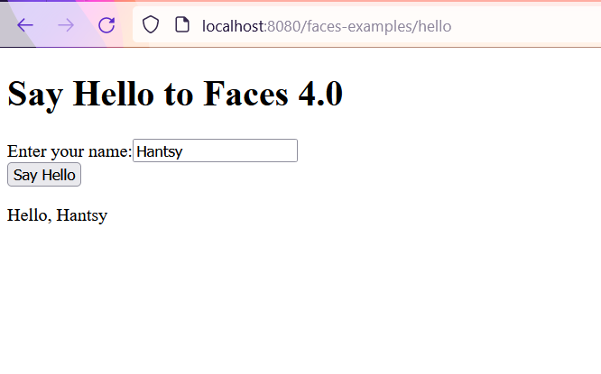

# New Features and Improvements

Next let's explore the changes in Faces 4.0.

## Extensionless Mapping

In the previous versions, `FacesServlet` is registered to handle mapping of *&lt;conext path>/myFacelets.xhtml*, *&lt;context path>/faces/myFacelets*, *&lt;context path>/myFacelets.faces*.

In Faces 4.0, it allows to map a URI without extension, eg. *&lt;conext path>/myFacelets*.

[Create a Jakarta EE web project](../jpa/jakartaee.md), add the following configuration in the *src/webapp/web.xml* file.

```xml
<context-param>
    <param-name>jakarta.faces.AUTOMATIC_EXTENSIONLESS_MAPPING</param-name>
    <param-value>true</param-value>
</context-param>
```

Add a simple CDI bean to activate Faces.

```java
@FacesConfig()
@ApplicationScoped
public class FacesCdiActivator {
}
```

> Note, the version attribute in annotation `@FacesConfig` is deprecated since Faces 4.0.

Create a Facelets view *src/webapp/hello.xhtml*.

```xml
<!DOCTYPE html>
<html lang="en"
      xmlns="http://www.w3.org/1999/xhtml"
      xmlns:f="jakarta.faces.core"
      xmlns:jsf="jakarta.faces"
      xmlns:h="jakarta.faces.html">
<f:view>
    <h:head>
        <title>Hello, Faces 4.0!</title>
    </h:head>
    <h:body>
        <h1>Say Hello to Faces 4.0</h1>
        <h:form prependId="false">
            <label jsf:for="name" jsf:required="true">Enter your name:</label>
            <input type="text"
                   jsf:id="name"
                   jsf:value="#{hello.name}"
                   jsf:required="true"
                   jsf:requiredMessage="Name is required."
                   placeholder="Type your name here..."
            />
            <h:message for="name"/>
            <br/>
            <input type="submit" jsf:id="submit" value="Say Hello"  jsf:action="#{hello.createMessage()}">
                <f:ajax execute="@form" render="@form"/>
            </input>
            <br/>
            <p id="message">#{hello.message}</p>
        </h:form>
    </h:body>
</f:view>
</html>
```

And create a backing bean to process the submission.

```java
@Named
@RequestScoped
public class Hello {
    private String name;
    private String message;

    public Hello() {
    }

    public void createMessage() {
        message = "Hello, " + name;
    }

    public String getName() {
        return name;
    }

    public void setName(String name) {
        this.name = name;
    }

    public String getMessage() {
        return message;
    }
}
```

Now execute the following command to run the applicaion on GlassFish.

```bash
> mvn clean package cargo:run
...
[INFO] Building war: D:\hantsylabs\jakartaee10-sandbox\faces\target\faces-examples.war
[INFO]
[INFO] --- cargo-maven3-plugin:1.10.4:run (default-cli) @ faces-examples ---
[INFO] [en3.ContainerRunMojo] Resolved container artifact org.codehaus.cargo:cargo-core-container-glassfish:jar:1.10.4 for container glassfish7x
[INFO] [talledLocalContainer] Parsed GlassFish version = [7.0.1]
[INFO] [talledLocalContainer] GlassFish 7.0.1 starting...
[INFO] [talledLocalContainer] Attempting to start cargo-domain.... Please look at the server log for more details.....
[INFO] [talledLocalContainer] GlassFish 7.0.1 started on port [8080]
[INFO] Press Ctrl-C to stop the container...
```

Open a web browser and navigate to <http://localhost:8080/faces-examples/hello>.

> NOTE: Here we do not append any extension on the URL.



Input anything in the text input field and click the **Say Hello** button. You will see a greeting message displayed as the above image.

## Writing Facelets in Java

In the previous version, Facelets view is a standard XHTML file. Since Faces 4.0, it is easy to compose a Faceslets view in pure Java codes.

The following is an example of writing Facelets view in Java.

```java
@View("/hello-facelet")
@ApplicationScoped
public class HelloFacelet extends Facelet {
    private static final Logger LOGGER = Logger.getLogger(HelloFacelet.class.getName());

    @Inject
    Hello hello;

    @Override
    public void apply(FacesContext facesContext, UIComponent root) throws IOException {
        if (!facesContext.getAttributes().containsKey(IS_BUILDING_INITIAL_STATE)) {
            return;
        }

        ELContext elContext = facesContext.getELContext();
        ExpressionFactory expressionFactory = facesContext.getApplication().getExpressionFactory();

        ComponentBuilder components = new ComponentBuilder(facesContext);
        List<UIComponent> rootChildren = root.getChildren();

        UIOutput output = new UIOutput();
        output.setValue("<html xmlns=\"http://www.w3.org/1999/xhtml\">");
        rootChildren.add(output);

        HtmlBody body = components.create(HtmlBody.COMPONENT_TYPE);
        rootChildren.add(body);

        var title = new UIOutput();
        title.setValue("<h1>Facelets View written in Java</h1>");
        body.getChildren().add(title);

        HtmlForm form = components.create(HtmlForm.COMPONENT_TYPE);
        form.setId("form");
        form.setPrependId(false);
        body.getChildren().add(form);

        HtmlOutputText message = components.create(HtmlOutputText.COMPONENT_TYPE);
        message.setId("message");
        form.getChildren().add(message);

        HtmlInputText input = components.create(HtmlInputText.COMPONENT_TYPE);
        input.setRendered(true);
        input.setLabel("Name");
        input.setValueExpression("value", expressionFactory.createValueExpression(elContext, "#{hello.name}", String.class));
        form.getChildren().add(input);

        HtmlCommandButton actionButton = components.create(HtmlCommandButton.COMPONENT_TYPE);
        actionButton.setId("button");
        actionButton.addActionListener(e -> {
                    LOGGER.log(Level.INFO, "local value: {0}", input.getLocalValue());
                    LOGGER.log(Level.INFO, "input value: {0}", input.getValue());
                    LOGGER.log(Level.INFO, "submitted value: {0}", input.getSubmittedValue());
                    LOGGER.log(Level.INFO, "value binding: {0}", new Object[]{input.getValueExpression("value").getValue(elContext)});

                    hello.createMessage();
                    message.setValueExpression("value", expressionFactory.createValueExpression(elContext, "#{hello.message}", String.class));
                }
        );
        actionButton.setValue("Say Hello");
        form.getChildren().add(actionButton);

        output = new UIOutput();
        output.setValue("</html>");
        rootChildren.add(output);
    }

    private static class ComponentBuilder {
        FacesContext facesContext;

        ComponentBuilder(FacesContext facesContext) {
            this.facesContext = facesContext;
        }

        @SuppressWarnings("unchecked")
        <T> T create(String componentType) {
            return (T) facesContext.getApplication().createComponent(facesContext, componentType, null);
        }
    }
}
```

As you see, the `HelloFacelet` extends `Facelet` and annotate with a `@View` annotation to specify the view path.

In the `HelloFacelet`, it injects the backed bean `Hello`, in the button event listener, it calls `Hello.createMessage` method to update message in view.

Now build and run the application.

```bash
mvn clean package cargo:run
```

Now open a browser and navigate to <http://localhost:8080/faces-examples/hello-facelet.xhtml>.

